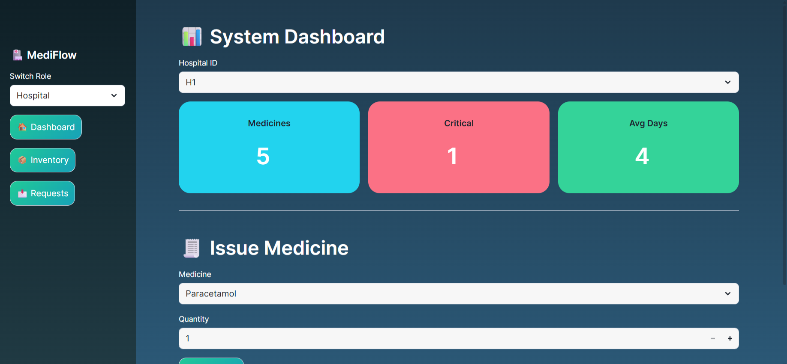
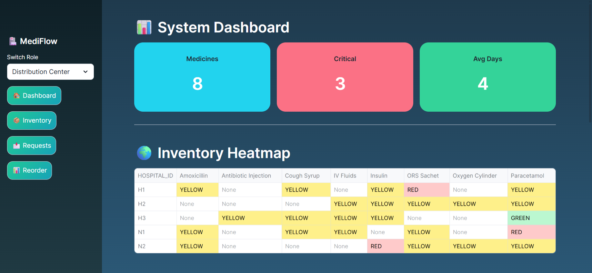
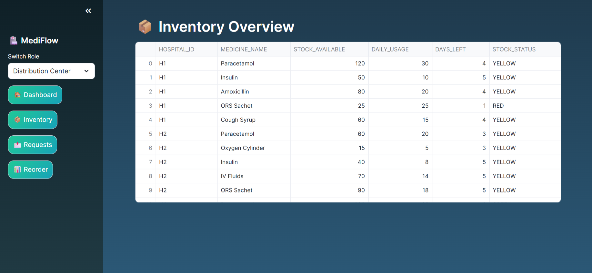
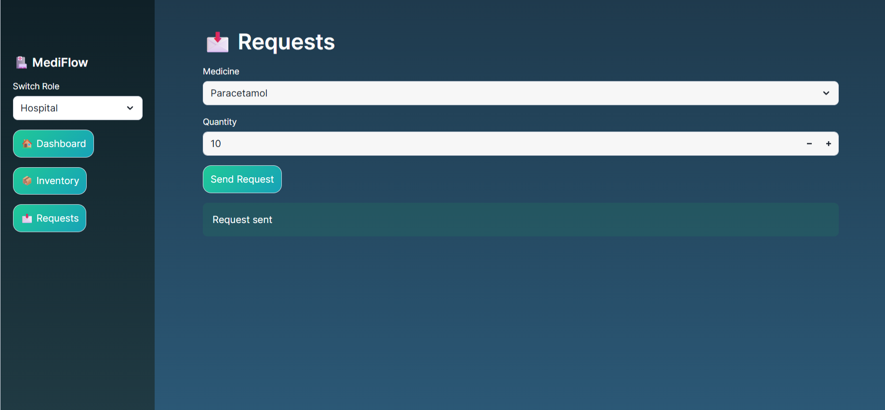

# MediFlow 🚑  
### Hospital Inventory & Stock Intelligence System

MediFlow is a **smart inventory intelligence platform** designed to help  
**hospitals, NGOs, and distribution centers** monitor medicine stock,  
predict shortages, and take proactive action — **before stock runs out**.

Built for real-world healthcare supply chain challenges using  
**Snowflake + Streamlit**.

---

## 🚀 Problem Statement
Healthcare institutions often face:
- Sudden medicine stock-outs
- Manual inventory tracking
- Late discovery of critical shortages
- No data-driven reorder planning

**MediFlow solves this by providing real-time visibility and intelligence.**

---
## 📸 Application Screenshots

### 🏥 System Dashboard
Overview of stock health, critical alerts, and usage metrics across hospitals.


### 🏬 Distribution Dashboard
Centralized view for distribution centers to monitor and manage supplies.


### 📦 Inventory Management
Real-time inventory visibility for each hospital and NGO.


### 📩 Hospital Requests
Request and approval workflow between hospitals and distribution centers.



## ✨ Key Features
- Hospital & NGO inventory tracking
- Real-time stock health status (Green / Yellow / Red)
- Critical stock alerts
- Medicine billing simulation
- Inventory heatmap across locations
- Intelligent reorder recommendations
- Hospital ↔ Distribution Center request workflow

---

## 🧠 What Makes MediFlow Different (USP)
- Predicts shortages **before they happen**
- Unified view across hospitals & NGOs
- Built on **cloud-native Snowflake architecture**
- Designed for **scalability & real deployment**
- Simple, visual, decision-friendly dashboard

---

## 🛠️ Tech Stack
- **Snowflake** – Database, Views, Analytics
- **Streamlit (Python)** – Interactive UI
- **Snowflake Snowpark** – Data processing
- **SQL** – Inventory intelligence logic

---

## 🗂️ Project Structure
MediFlow/
│
├── streamlit_app.py # Main Streamlit application
├── MediFlow_Setup.sql # Database, tables, views & sample data
├── requirements.txt # Python dependencies
└── README.md # Project documentation

## YouTube video link: https://youtu.be/Q3HrB-7ZZwI

## ▶️ How to Run (Snowflake – Recommended)

1. Open **Snowflake Worksheets**
2. Run the SQL file:
MediFlow_Setup.sql

markdown
Copy code
3. Open **Snowflake → Projects → Streamlit**
4. Upload `streamlit_app.py`
5. Run the app

✅ This is the **primary and recommended way**  
✅ Used for **hackathon demo & evaluation**

---

## 💻 Run Locally (For Developers)

> ⚠️ Note: A **Snowflake account is required** to run locally.

### Prerequisites
- Python **3.9 or higher**
- Snowflake account
- Snowflake credentials configured locally

### Steps

1. Clone the repository
```bash
git clone https://github.com/Prashantpd7/MediFlow.git
cd MediFlow
Create virtual environment

bash
Copy code
python -m venv venv
venv\Scripts\activate   # Windows
Install dependencies

bash
Copy code
pip install -r requirements.txt
Configure Snowflake credentials
(via environment variables / Snowflake config)

Run the app

bash
Copy code
streamlit run streamlit_app.py
🎯 Use Cases
Hospital inventory monitoring

NGO medicine distribution planning

Emergency stock shortage prevention

Supply chain optimization in healthcare

👨‍💻 Author
Prashant Dwivedi
Computer Science Engineer | UI/UX | Data & Cloud Enthusiast

🏁 Hackathon Note
This project demonstrates:

Real-world problem solving

Scalable cloud architecture

Data-driven decision making

Practical healthcare impact

⭐ If you like this project, consider starring the repo!

yaml
Copy code

---

## ✅ What you should do NOW
1. Replace your `README.md` with the above content
2. Commit & push:
   ```bash
   git add README.md
   git commit -m "Improve README for hackathon & local setup"
   git push origin main

   ## Note for Evaluators
This project uses Snowflake as a managed cloud database.
To run locally, a Snowflake account is required.
The Streamlit UI and SQL logic are fully included in this repository.
